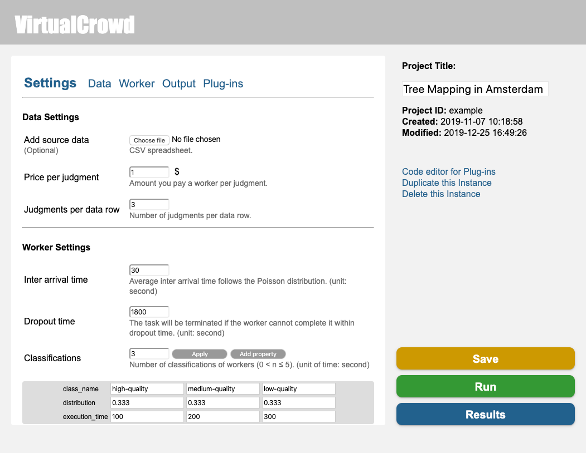
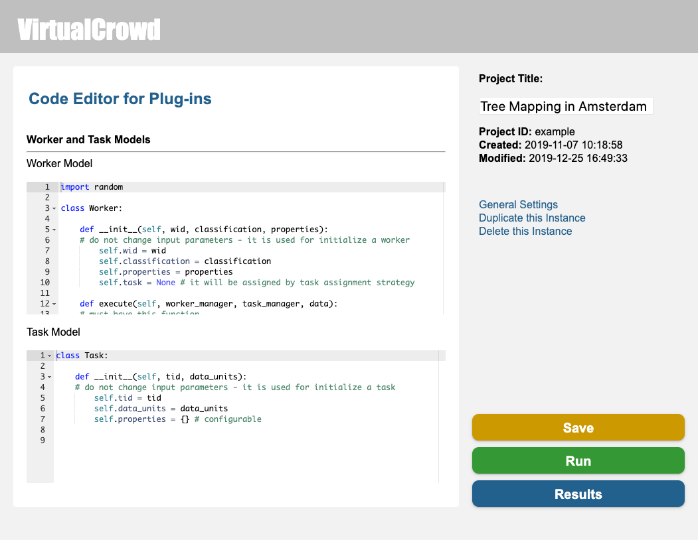
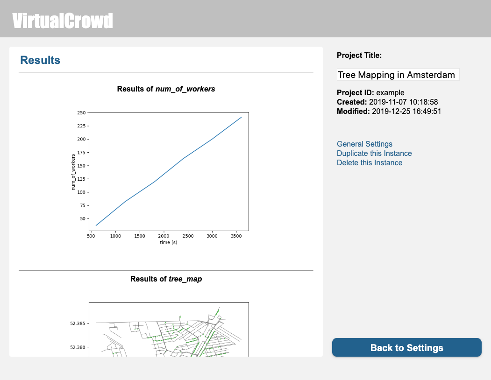

# VirtualCrowd
A Simulation Platform for Microtask Crowdsourcing Campaigns

## Usage
You can launch the server by running:
```
python3 main.py
```
Then open `http://localhost:5000/` in your browser.

## System preview

| General settings         | Plugin settings           | Simulation results        |
|:------------------------:|:-------------------------:|:-------------------------:|
|  |   |   |

## Dependencies
Ace (https://ace.c9.io/): Ace is already included in the repository. Please unzip `static/js/ace.zip`.
